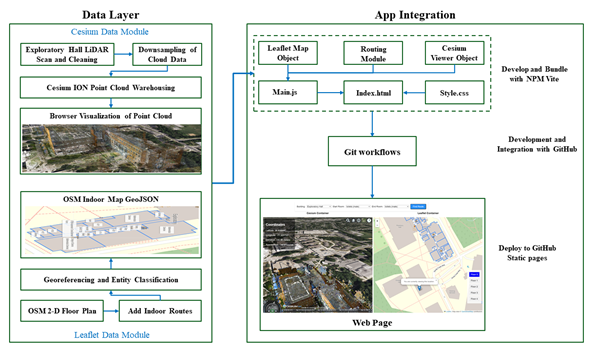

# LiDAR-Based Indoor Navigation System

## Project Overview

This repository hosts the code for a JavaScript-based indoor navigation system using LiDAR data. The app is accessible from [here](https://denniesbor.github.io/campus-map).



## Setup and Running the Project

### Prerequisites

- Node.js installed on your machine.

### Installation and Execution

1. **Clone the repository:**
   ```bash
   git clone https://github.com/yourusername/lidar-indoor-navigation.git
   cd campus-map
npm install
npm run dev
```
